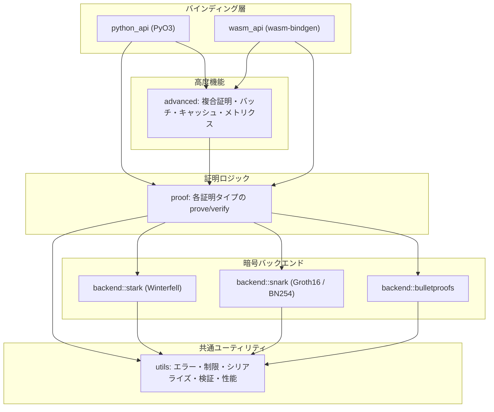

# libzkp アーキテクチャ

このドキュメントは `libzkp` の内部構造、レイヤー境界、暗号バックエンドの割り当て、およびビルドターゲット（Rust / Python / WASM）の関係を説明します。API の一覧は [overview.md](./overview.md) および [api.md](./api.md) を参照してください。

## 目的とスコープ

`libzkp` は **複数のゼロ知識証明スキームを一つのクレートに統合**し、共通の **証明バイト列フォーマット**（`Proof`）で扱えるようにしたライブラリです。各「証明タイプ」は **専用の暗号バックエンド**（Bulletproofs / Groth16 SNARK / STARK）のいずれかを用い、Rust のコア実装の上に **言語バインディング**（PyO3、wasm-bindgen）を載せています。

## レイヤー構造

論理的には次の **下位から上位** の依存関係になります。

| レイヤー | 役割 |
| --- | --- |
| **`proof`** | 各ドメイン（範囲・等価性など）の **公開 API**。入力検証、`Proof` の組み立て、スキーム ID の固定、バックエンド呼び出しを担当。 |
| **`backend`** | 実際の **証明生成・検証** と、バックエンド固有のワイヤ形式（例: Bulletproofs の proof body + 32 バイトコミットメント）。`ZkpBackend` トレイトで抽象化されたエントリもある。 |
| **`utils`** | **エラー型**（`ZkpError`）、**サイズ上限**、**証明バイト列のパース**、**コミットメント**、**複合証明の構造**、**キャッシュ・並列検証** など横断的関心事。 |
| **`advanced`** | 単一証明の上に載る **複合証明・メタデータ・バッチ処理・ベンチマーク・キャッシュ付きラッパ** など。 |
| **`python_api` / `wasm_api`** | コアを **Python または JavaScript** から呼ぶ薄いアダプタ。エラーは `PyResult` / `JsError` にマッピング。 |

## クレート構成（ソースツリー）

| パス | 内容 |
| --- | --- |
| `src/lib.rs` | クレートルート。`advanced` / `backend` / `proof` / `utils` を公開。`python` / `wasm` フィーチャで各 API モジュールを有効化。 |
| `src/proof/` | `Proof` 型とスキーム別モジュール（`range_proof`, `equality_proof`, …）。 |
| `src/backend/` | `bulletproofs`, `snark`, `stark` 実装。 |
| `src/utils/` | 共通ユーティリティ（`error_handling`, `limits`, `proof_helpers`, `composition`, `performance`, など）。 |
| `src/advanced/` | `composite`, `batch` と、キャッシュ・メトリクスを含む `mod.rs` の API。 |
| `src/python_api.rs` | PyO3 マクロで `proof` / `advanced` へ委譲。 |
| `src/wasm_api.rs` | ブラウザ向けに限定された関数群（範囲・所属・しきい値・複合・キャッシュ等）。 |

## 証明の共通エンベロープ `Proof`

すべての単体証明は **`Proof` 構造体**として **バイト列に直列化**されます（`proof/mod.rs`）。

- **`version`**: フォーマット版（現在 `PROOF_VERSION = 2`）。
- **`scheme`**: どの証明タイプ／バックエンド解釈かを示す **スキーム ID**（下表）。
- **`proof`**: バックエンド依存の本体ペイロード。
- **`commitment`**: 多くのスキームで **32 バイト**のコミットメント（バックエンドにより意味が異なる）。

エンコーディングは **先頭に version・scheme・長さフィールド** を置き、総サイズと整合性チェックを `utils::limits` の上限と組み合わせて検証します。

### スキーム ID とバックエンド対応

| `scheme` | 証明タイプ | バックエンド | 備考 |
| --- | --- | --- | --- |
| `1` | 範囲（Range） | Bulletproofs | `curve25519-dalek` / `bulletproofs` |
| `2` | 等価性（Equality） | SNARK (Groth16 on BN254) | コミットメントと回路内整合 |
| `3` | しきい値（Threshold） | Bulletproofs | 和と閾値の関係 |
| `4` | 集合所属（Membership） | SNARK | 集合サイズに上限（実装で `MAX_SET_SIZE`） |
| `5` | 向上（Improvement） | STARK (Winterfell) | `old` / `new` をペイロードに含む |
| `6` | 整合性（Consistency） | Bulletproofs | データ列の性質 |

**複合証明**（`advanced::composite`）は複数の `Proof` を束ね、`utils::composition::CompositeProof` として **別のバイト列**になります（単体 `Proof` の `scheme` とは別レイヤ）。

## バックエンドの責務

### Bulletproofs (`backend::bulletproofs`)

- 範囲・しきい値・整合性など **Pedersen コミットメント上の線形/範囲系**に使用。
- ジェネレータはビット幅・パーティ数に応じてキャッシュ（`OnceLock`）され、繰り返し証明のコストを抑える。

### SNARK (`backend::snark`)

- **Groth16**（`ark-groth16` + `ark-bn254`）で等価性・集合所属を実装。
- いずれも値に対する公開コミットメントは **MiMC-5（BN254 Fr）→ 32 バイト**（`utils::commitment::commit_value_snark`）。SHA-256 ベースの `commit_value` とは別物で、README やサンプルで混同しないこと。
- 集合所属では **集合は検証鍵に関連する公開入力**として扱われ、検証者は証明と同じ集合を渡す必要がある（集合そのものを「隠す」設計ではない）。
- **proving key / verifying key** は環境変数 `LIBZKP_SNARK_KEY_DIR` または API `set_snark_key_dir` で指定したディスクに保存・読込し、プロセス間で再利用可能（`advanced` からも公開）。

### STARK (`backend::stark`)

- **Winterfell** ベースで「改善」系のトレース証明を生成（`prove_improvement` / `verify_improvement`）。

## ビルドとフィーチャ

`Cargo.toml` のフィーチャにより **依存とエントリポイント**が切り替わります。

| フィーチャ | 効果 |
| --- | --- |
| `default` | `python` + `parallel` + `batch-store` |
| `python` | `pyo3`、Python モジュール `libzkp` |
| `python-extension` | 共有ライブラリとしてロードする拡張向け（`extension-module`） |
| `wasm` | `wasm-bindgen`、`getrandom` の `js`、WASM 向け `clear_on_drop` など |
| `parallel` | `rayon`（無効時は Rust のみ・依存縮小） |
| `batch-store` | 証明バッチのディスク永続化（`serde` / `bincode` / `fs4`）、`advanced::batch_store` |

- **`--no-default-features`** で Python を外した **純 Rust ライブラリ**ビルドが可能。
- **WASM** では `crate-type` に `cdylib` が含まれるため、`wasm32-unknown-unknown` 向けに `wasm` フィーチャを有効してビルドする想定（`pkg/` への出力は別手順）。

## データフロー（概念）

1. **呼び出し**: バインディングまたは Rust から `prove_*` が呼ばれる。
2. **検証**: `utils::validation` で入力パラメータを検証。
3. **証明生成**: 対応する `backend::*` が生バイト列（とコミットメント）を返す。
4. **ラップ**: `proof_helpers` 等で `Proof::new(scheme, …).to_bytes()` に整形。
5. **検証側**: `from_bytes` → スキーム ID に応じてバックエンドの `verify_*` を呼ぶ。

`advanced` の **キャッシュ**は主にキー生成と保存で、暗号学的には同一パラメータなら同一証明バイト列が返る想定の最適化です（用途に応じて無効化・クリアを検討）。

`batch-store` 有効時、`advanced::batch` はオプションで **ディレクトリ内の `batch_*.bin`** にバッチ操作列を保存し、ファイルロック付きで読み書きします（マルチプロセスでは単一ライター前提で `refresh_batch_from_store` により他プロセスの更新を取り込む想定）。

## エラーと境界

- コアは **`ZkpResult` / `ZkpError`** で失敗を表現。
- Python では `map_err(Into::into)` で **PyO3 の例外**に変換。
- WASM では **`JsError`** にメッセージ文字列化して伝播。

`validate_proof_chain` など一部 API は **バイト列の構造妥当性のみ**を見ており、**暗号学的検証を省略**する旨がコードコメントに明記されています。利用時は意味を取り違えないよう注意してください。

## 関連ドキュメント

- [overview.md](./overview.md) — 機能概要とビルド手順
- [api.md](./api.md) — Python API 詳細
- [pkg/README.md](../pkg/README.md) — WASM パッケージ利用（存在する場合）

## 変更時の指針

- 新しい証明タイプを追加する場合: **`scheme` ID の予約**、`Proof::from_bytes` との互換、`limits` の見直し、各バックエンドのワイヤ形式を `proof_helpers` に集約する。
- バインディングに公開するかは **`python_api` / `wasm_api` に明示的に追加**する必要がある（Rust の `pub` だけでは外部言語に出ない）。
